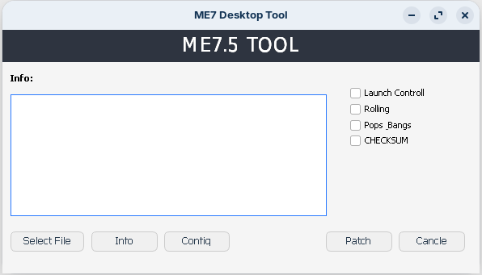
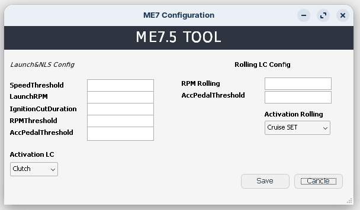
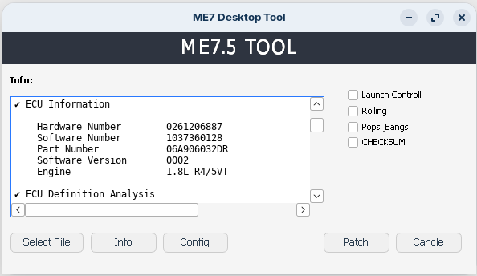
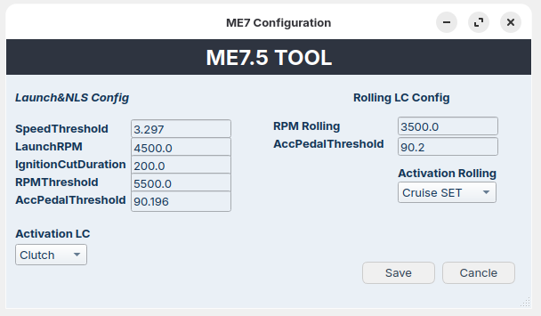

<h2>Screenshots</h2>

<h3>Main Window — Empty</h3>

<p align="center">
  
</p>

<h3>Configuration Window — Empty</h3>

<p align="center">
  
</p>

<h3>Main Window — Loaded</h3>

<p align="center">
  
</p>

<h3>Configuration Window — Loaded</h3>

<p align="center">
  
</p>


# 🚗 ME7 Desktop Tool GUI

**A complete graphical toolkit for analyzing and modifying Bosch ME7 / ME7.5 ECU firmware.**

ME7 Desktop Tool GUI is a Windows desktop application designed for working with Bosch ME7.x ECU binary files.

The application allows users to analyze ECU firmware, install features such as **Launch Control**, **Rolling Anti-Lag**, and **Pops & Bangs**, configure all installed functions, automatically calculate checksums, verify the final firmware, and save the finished BIN file.

The software always works on **temporary working copies** of the selected firmware.

✅ **The original BIN file is never modified or overwritten.**

---

# ✨ Main Features

## 📂 Open BIN

Load an ECU firmware file into the application.

The program automatically creates a temporary working copy and performs an initial firmware analysis.

The original firmware always remains untouched.

---

## 🔍 ECU Analysis

Automatically reads and verifies ECU information.

Detected information includes:

* ✅ Firmware size
* ✅ Firmware integrity
* ✅ ECU identification
* ✅ Bosch Hardware Number
* ✅ Bosch Software Number
* ✅ VAG Part Number
* ✅ Software Version
* ✅ Engine Identification
* ✅ Bootloader Information
* ✅ ECU Inputs and Switch Detection
* ✅ Existing Feature Detection

The detected information is used by the installation and configuration system.

---

## 🚀 Launch Control

Installs Launch Control / ALS / NLS into the ECU firmware.

The application automatically:

* Finds a suitable code cave
* Installs the required hook
* Creates a configuration block
* Detects existing Launch Control installations

### Configurable Parameters

* 🚗 Launch RPM
* 🚗 Speed Threshold
* 🔥 RPM Threshold
* 👣 Throttle Threshold
* 💥 Ignition Cut Duration
* 🎛 Activation Trigger

Supported activation inputs:

* Clutch
* Brake

---

## 💨 Rolling Anti-Lag

Installs Rolling Anti-Lag support.

Supported installation modes:

✅ Standalone

✅ Chain Mode (compatible with existing Launch Control)

The application automatically:

* Detects the correct activation trigger
* Installs Rolling code
* Creates a dedicated variables block
* Preserves compatibility with Launch Control

### Configurable Parameters

* Rolling RPM
* Throttle Threshold
* Activation Trigger

Supported triggers:

* Cruise SET
* Cruise RES
* Brake

---

## 💥 Pops & Bangs

Automatically installs Pops & Bangs modifications.

The application searches for and modifies the required calibration maps, including:

* KFZWMN
* KFNWEGM
* KFTVSA
* KFTVSAKAT

### Available Profiles

🟢 Low

🟡 Medium

🔴 High

Immediately after enabling Pops & Bangs, a profile selection dialog appears.

The generated firmware is automatically verified before continuing.

---

## ⚙️ Configuration Window

After detecting or installing supported features, the configuration window allows editing of all available parameters.

Supported configuration:

### Launch Control

* Launch RPM
* Speed Threshold
* RPM Threshold
* Throttle Threshold
* Ignition Cut Duration
* Activation Trigger

### Rolling Anti-Lag

* Rolling RPM
* Throttle Threshold
* Activation Trigger

---

## 🔥 Soft Cut

Experimental Soft Cut mode for Launch Control.

When enabled:

* Ignition Cut Duration is automatically set to **20 ms**
* The original OEM FTOMN value is restored when required

---

## ✅ Automatic Checksum Correction

Firmware checksums are automatically corrected using:

```text
ME7Sum
```

Checksum correction is performed **only once**, after every selected modification and configuration change has been completed.

---

## 💾 Save & Finalize

The final save procedure automatically performs:

1. Writing all selected configuration values
2. Installing selected features
3. Correcting firmware checksums
4. Performing final firmware verification
5. Saving the finished BIN file

---

## 📋 Information Window

The built-in information window provides:

* General application overview
* Feature descriptions
* Basic usage information

It is intended for documentation purposes only and does not display diagnostic logs.

---

## 🗂 Temporary Workspace

The application creates a temporary runtime workspace while processing firmware.

During operation it automatically:

* Extracts all required internal tools
* Creates temporary firmware copies
* Performs all firmware modifications

When the application is closed normally, all temporary files are removed automatically.

Only the firmware explicitly saved by the user remains on disk.

---

# 🧰 Built-in Tools

The application internally uses:

```text
launch.exe
rolling_chain.exe
PopsAndBangs_CMD.exe
ME7Info.exe
ME7Check.exe
ME7Sum.exe
```

All required tools are embedded inside the application.

No manual installation or configuration is required.

---

# 🛡 Safety

The application:

* ✅ Never overwrites the original BIN file
* ✅ Always works on temporary firmware copies
* ✅ Automatically corrects firmware checksums
* ✅ Performs final firmware verification before saving

---

# ❤️ Free Software

ME7 Desktop Tool GUI is a completely free project created for the Bosch ME7 community.

You are welcome to:

* Use it
* Study the source code
* Modify it
* Improve it
* Report bugs
* Submit Pull Requests

Any contribution that helps improve the project is greatly appreciated.

---

# ⚠️ Disclaimer

This software is intended for educational, research, motorsport, and off-road use.

The author assumes no responsibility for:

* ECU damage
* Engine damage
* Turbocharger damage
* Catalytic converter damage
* Failed ECU flashing
* Incorrect firmware modifications
* Vehicle damage
* Legal consequences resulting from software use

Use this software entirely at your own risk.
